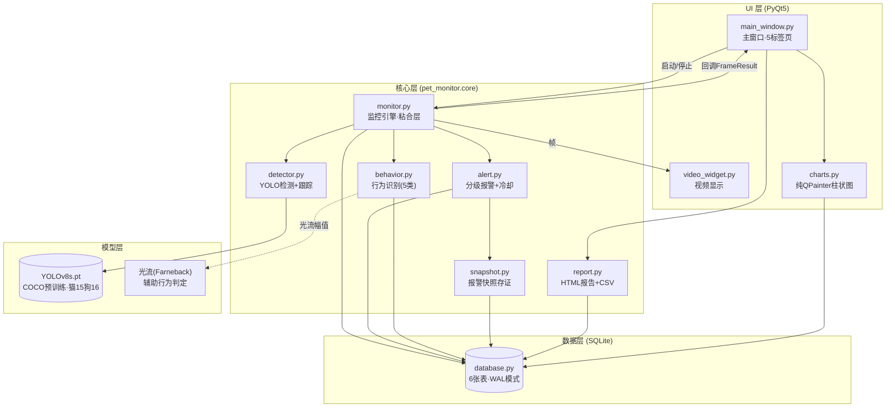
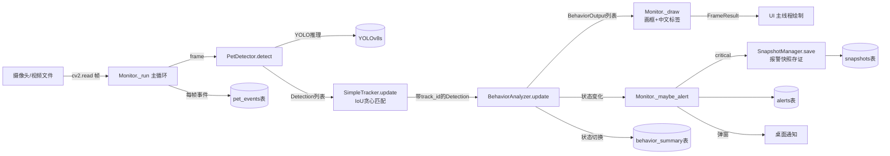
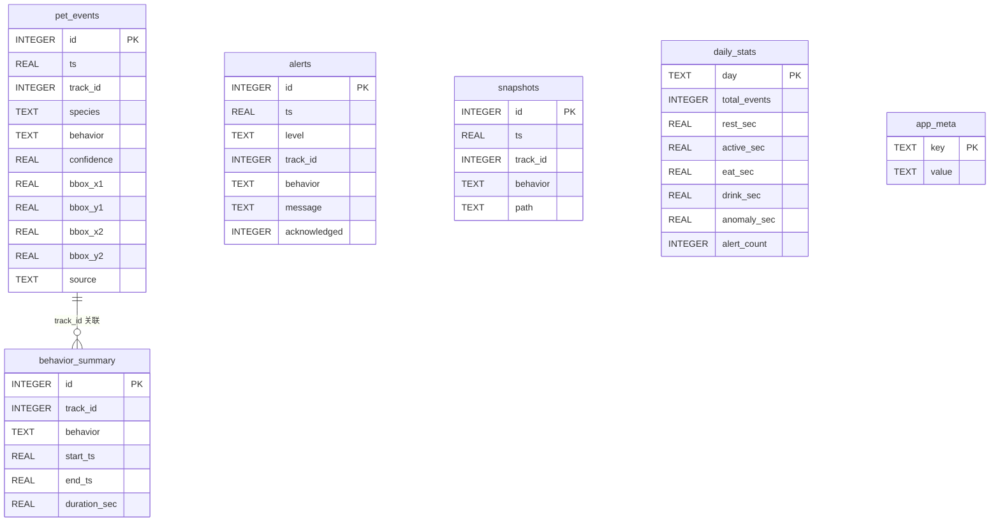
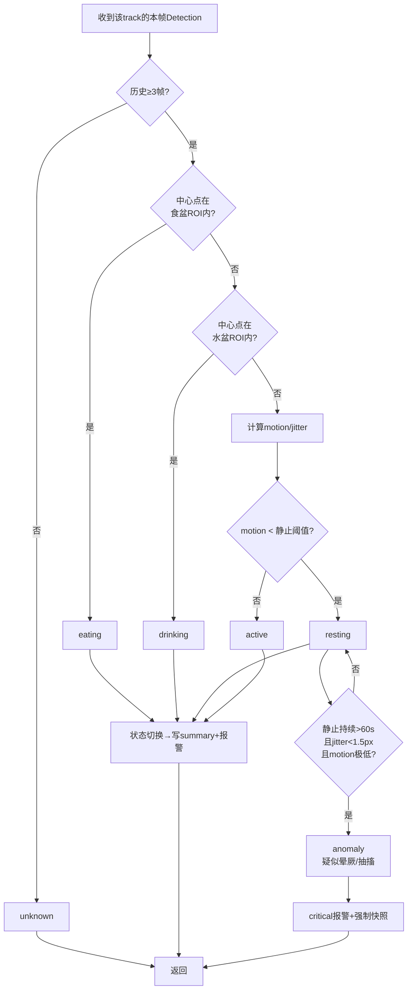
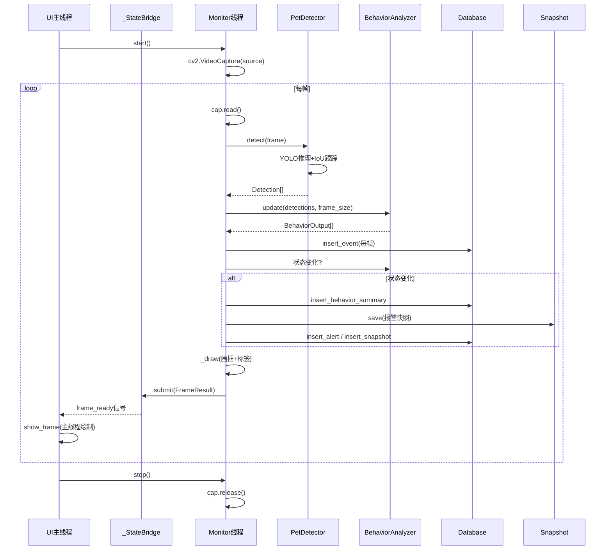
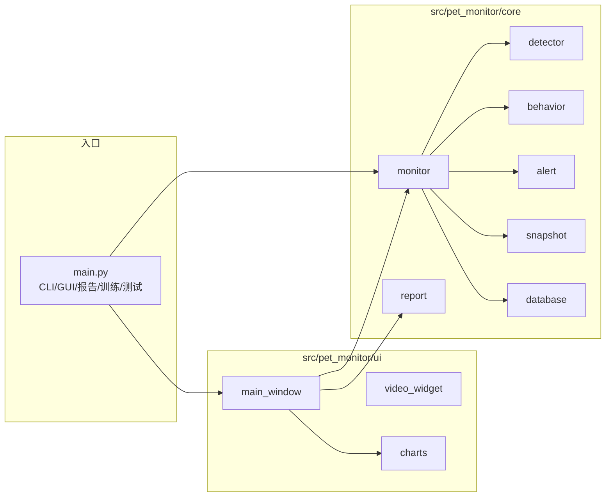

# 08 · 系统设计图

> 本文档用 Mermaid 描述系统架构、数据流、数据库 ER、行为判定流程与监控线程时序。
> GitHub / VS Code Mermaid 预览可直接渲染为图片，答辩 PPT 截图即可使用。

---

## 一、系统分层架构图

系统采用经典的四层结构：**UI 层 → 核心层 → 数据层 → 模型层**。UI 层只负责展示与交互，核心层把检测、跟踪、行为识别、报警、快照、统计串成数据通路，数据层用 SQLite 持久化，模型层封装 YOLOv8。

**设计要点**

- **单向依赖**：UI 层只调用核心层公开 API，核心层不反向引用 UI（线程安全，`_StateBridge` 用信号跨线程传递 `FrameResult`）。
- **粘合层模式**：`monitor.py` 是唯一的"编排者"，detector/behavior/alert/snapshot/database 互相不直接耦合，便于单元测试时整体替换（见 `TestMonitorAlerting`）。
- **零外部服务依赖**：YOLO 离线推理、SQLite 本地存储、报告自包含 HTML（内联 CSS+SVG），换台电脑克隆仓库即可运行。

---

## 二、单帧数据流图

描述一帧画面从摄像头/视频读入，到最终落库、报警、快照、绘制回显的完整通路。

**关键流转**

| 环节 | 频率 | 落库表 |
| --- | --- | --- |
| 每帧检测事件 | ~25 FPS | `pet_events` |
| 行为状态切换 | 状态变化时 | `behavior_summary` |
| 分级报警 | 状态变化+冷却 | `alerts` |
| 报警快照 | critical 强制 / info 可选 | `snapshots` |
| 每日汇总 | 手动/定时 | `daily_stats` |

---

## 三、数据库 ER 图

共 6 张表。`pet_events` 是高频写入的事件流，`behavior_summary` 是状态段汇总，`alerts`/`snapshots` 由报警触发，`daily_stats` 是按天聚合，`app_meta` 存应用元数据。

**索引**：`pet_events(ts)`、`pet_events(track_id)`、`behavior_summary(track_id)`、`alerts(ts)`、`snapshots(ts)`，保证按时间/目标的查询效率。
**并发**：开启 `journal_mode=WAL` + `synchronous=NORMAL`，监控线程高频写、UI 线程并发读不阻塞。

---

## 四、行为判定决策流程图

`BehaviorAnalyzer._classify` 对单个 track 的判定顺序：先 ROI（食盆/水盆），再运动量静止/活跃，最后长时静止升级异常。优先级从上到下短路。

**判定依据（启发式，零监督学习）**

| 行为 | 主判据 | 辅判据 |
| --- | --- | --- |
| eating | 中心点 ∈ food_roi | 停留 ≥ consum_min_dwell_sec |
| drinking | 中心点 ∈ water_roi | 停留 ≥ consum_min_dwell_sec |
| resting | motion < resting_motion_px | 持续 ≥ rest_min_duration_sec |
| active | motion > active_motion_px_per_frame | — |
| anomaly | resting 持续 > 60s + 微抖动 | motion < 静止阈值×0.5 |

> 局限：纯几何/运动启发式对"睡觉 vs 晕厥"区分有限；后续可引入光流（已接入 `behavior._flow_magnitude`）或姿态/时序模型提升。

---

## 五、监控线程时序图

`Monitor` 起一个后台守护线程读帧，UI 主线程不阻塞。`_StateBridge` 用 Qt 信号把后台结果安全送到主线程。

**线程安全要点**

- 后台线程**只**通过 `on_result` 回调（经 `_StateBridge` 信号）与 UI 通信，绝不直接操作控件。
- `Database` 内部用 `threading.Lock` 串行化所有连接，WAL 模式下读不阻塞写。
- `AlertSystem` 的蜂鸣/弹窗通过回调在主线程触发（PyQt5 控件不可在非主线程创建）。

---

## 六、文件结构与职责对照

---

## 附：图的查看与导出

- **GitHub**：直接在仓库 `docs/08_系统设计图.md` 页面查看，Mermaid 自动渲染。
- **VS Code**：装 `Markdown Preview Mermaid Support` 插件即可预览。
- **导出 PNG（答辩用）**：用 [mermaid.live](https://mermaid.live) 粘贴代码块导出图片，或 `npm i -g @mermaid-js/mermaid-cli && mmdc -i 08.md -o 08.png`。
