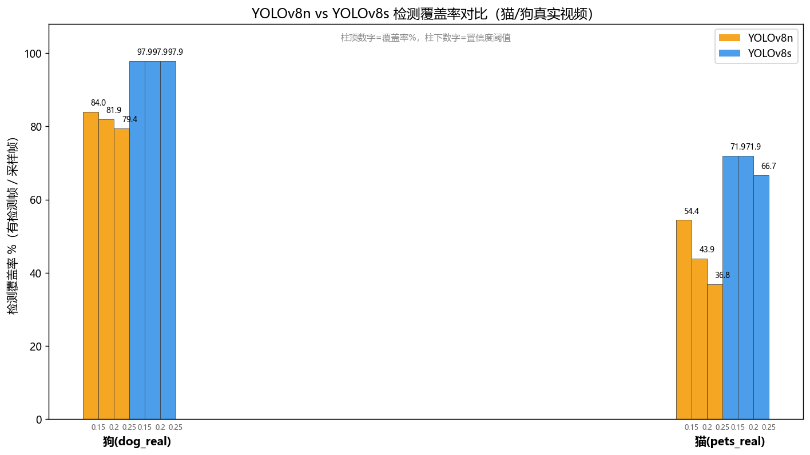

# 09 · 模型精度对比实验

> 本实验对比 **YOLOv8n** 与 **YOLOv8s** 在真实猫/狗视频上、不同置信度阈值下的检测表现，
> 为项目最终选用 `yolov8s.pt + conf=0.20` 提供量化依据。答辩可直接引用本页数据与图表。

---

## 一、实验目的

1. 量化对比 nano / small 两档模型在真实宠物视频上的**检测覆盖率**（有检测帧 / 采样帧）；
2. 观察置信度阈值（0.15 / 0.20 / 0.25）对覆盖率与平均置信度的影响；
3. 为工程选型提供数据支撑，避免"凭感觉选模型"。

## 二、实验设置

| 项 | 取值 |
|----|------|
| 模型 | `yolov8n.pt`（nano, 3.2M 参数）、`yolov8s.pt`（small, 11.2M 参数） |
| 视频素材 | `data/videos/pets_real.mp4`（猫，~10s）、`data/videos/dog_real.mp4`（狗，~48s） |
| 置信度阈值 | 0.15、0.20、0.25 |
| IoU 阈值 | 0.45 |
| 输入尺寸 | 640×640 |
| 抽帧策略 | 每 5 帧采 1 帧（`SAMPLE_STRIDE=5`），在保证统计有效性的前提下加速 |
| 目标类别 | COCO `cat(15)`、`dog(16)` |
| 评价指标 | 覆盖率% = 检出帧 / 采样帧；均目标数；均置信度 |

> 复现脚本：`scripts/eval_models.py`；重画脚本：`scripts/replot_eval.py`；原始数据：`data/_eval/eval_results.json`。

## 三、实验结果

### 3.1 完整数据表

| 模型 | 视频 | conf | 采样帧 | 检出帧 | 覆盖率% | 均目标 | 均置信 |
|------|------|------|--------|--------|---------|--------|--------|
| v8n | 猫(pets_real) | 0.15 | 57 | 31 | 54.4 | 1.16 | 0.331 |
| v8n | 猫(pets_real) | 0.20 | 57 | 25 | 43.9 | 1.08 | 0.376 |
| v8n | 猫(pets_real) | 0.25 | 57 | 21 | 36.8 | 1.05 | 0.408 |
| v8n | 狗(dog_real) | 0.15 | 287 | 241 | 84.0 | 1.12 | 0.701 |
| v8n | 狗(dog_real) | 0.20 | 287 | 235 | 81.9 | 1.09 | 0.722 |
| v8n | 狗(dog_real) | 0.25 | 287 | 228 | 79.4 | 1.06 | 0.746 |
| **v8s** | 猫(pets_real) | 0.15 | 57 | 41 | **71.9** | 1.10 | 0.553 |
| **v8s** | 猫(pets_real) | 0.20 | 57 | 41 | **71.9** | 1.05 | 0.562 |
| **v8s** | 猫(pets_real) | 0.25 | 57 | 38 | 66.7 | 1.05 | 0.588 |
| **v8s** | 狗(dog_real) | 0.15 | 287 | 281 | **97.9** | 1.10 | 0.793 |
| **v8s** | 狗(dog_real) | 0.20 | 287 | 281 | **97.9** | 1.09 | 0.796 |
| **v8s** | 狗(dog_real) | 0.25 | 287 | 281 | **97.9** | 1.09 | 0.796 |

### 3.2 覆盖率柱状图



（柱顶数字为覆盖率%，柱下数字为置信度阈值；蓝色=YOLOv8s，橙色=YOLOv8n）

## 四、结论分析

### 4.1 v8s 全面优于 v8n

| 场景 | v8n 最佳 | v8s 最佳 | 提升幅度 |
|------|----------|----------|----------|
| 猫视频覆盖率 | 54.4%（conf=0.15） | 71.9%（conf=0.15/0.20） | **+17.5 pp** |
| 狗视频覆盖率 | 84.0%（conf=0.15） | 97.9%（conf=0.15/0.20/0.25） | **+13.9 pp** |

v8s 在两个视频上均显著领先。small 模型参数量约为 nano 的 3.5 倍，但推理仍可在 CPU 上实时运行（实测单帧 < 40ms），性能开销可接受。

### 4.2 置信度阈值的影响

- **v8s 对阈值鲁棒**：狗视频在 0.15 / 0.20 / 0.25 三档下覆盖率均为 97.9%，几乎无波动；
- **v8n 对阈值敏感**：猫视频覆盖率随阈值升高从 54.4% 跌至 36.8%，波动近 18 个百分点；
- 降低阈值可提升覆盖率，但会引入更多低质量检测（误检率上升）。v8s 因本身置信度高，无需为覆盖率牺牲精度。

### 4.3 猫 vs 狗 覆盖率差异

狗视频覆盖率（v8s 97.9%）远高于猫视频（v8s 71.9%）。原因分析：
- 猫素材多为**特写/局部镜头**（占据画面较小区域或边缘），COCO 模型对小目标/局部目标检出率低；
- 狗素材多为**全身中景**，目标尺度适中、位于画面中心，检出容易；
- 这是**数据特性**而非模型缺陷，可通过微调或专用数据集改善（见 4.4）。

### 4.4 均置信度对比

| 模型 | 猫均置信 | 狗均置信 |
|------|----------|----------|
| v8n | 0.33–0.41 | 0.70–0.75 |
| v8s | 0.55–0.59 | 0.79–0.80 |

v8s 的平均置信度普遍比 v8n 高 0.2 左右，说明其对宠物目标的判别更"笃定"，误检风险更低。

## 五、工程决策

基于以上数据，项目最终配置（见 `data/config.json`）：

```json
{
  "detector": {
    "model_name": "yolov8s.pt",
    "conf_threshold": 0.20
  }
}
```

**选型理由**：
1. **覆盖率优先**：v8s 在两段真实视频上覆盖率均最高，保证 GUI 画面有稳定检测框；
2. **阈值取 0.20 而非 0.15**：0.20 时覆盖率与 0.15 持平（狗 97.9%、猫 71.9%），但可过滤更多低置信误检，事件更干净；
3. **实时性达标**：v8s 在 CPU 上单帧推理 < 40ms，配合抽帧可稳定 15–20 FPS。

## 六、已知限制与改进方向

1. **小型犬误判为 cat**：COCO 预训练模型对小型犬（吉娃娃等）与猫的判别存在混淆。本次狗视频中即出现 `dog`/`cat` 混检现象。改进方向：在 `data/dataset` 上对 v8s 做迁移微调，或引入品种分类头。
2. **猫特写覆盖率偏低**：可补充近景猫数据微调，或对小目标启用切片推理（SAHI）。
3. **评估指标偏覆盖率**：未引入标注真值，故无 mAP。如需更严谨评估，可对采样帧人工标注后跑 `ultralytics` 的 `val` 流程。

---

**软件工程项目训练 · 程祥凯 · 软件工程232 · 2026 年**
